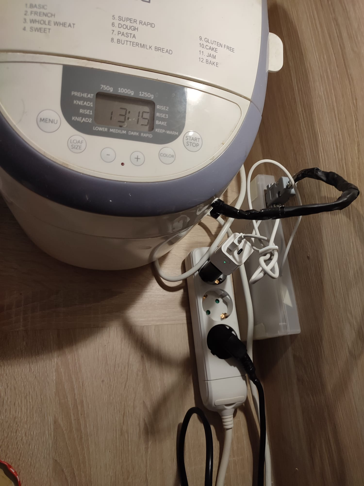
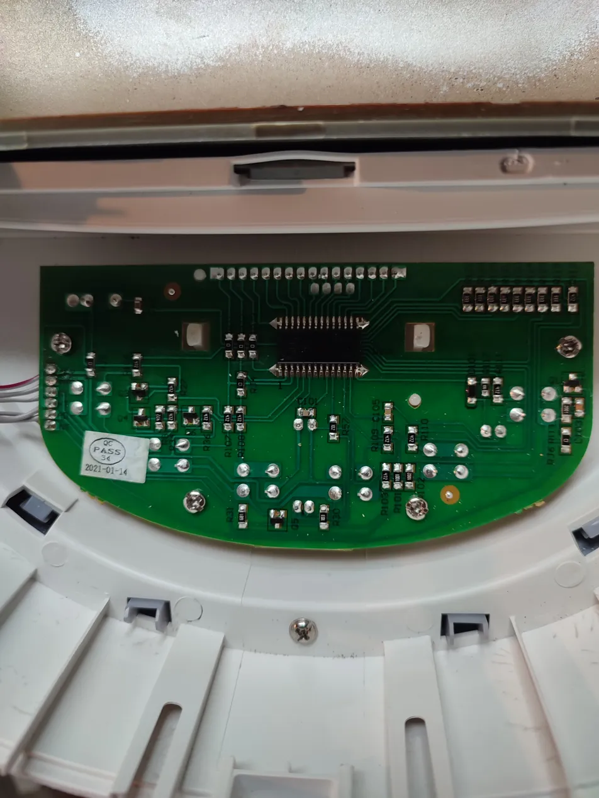
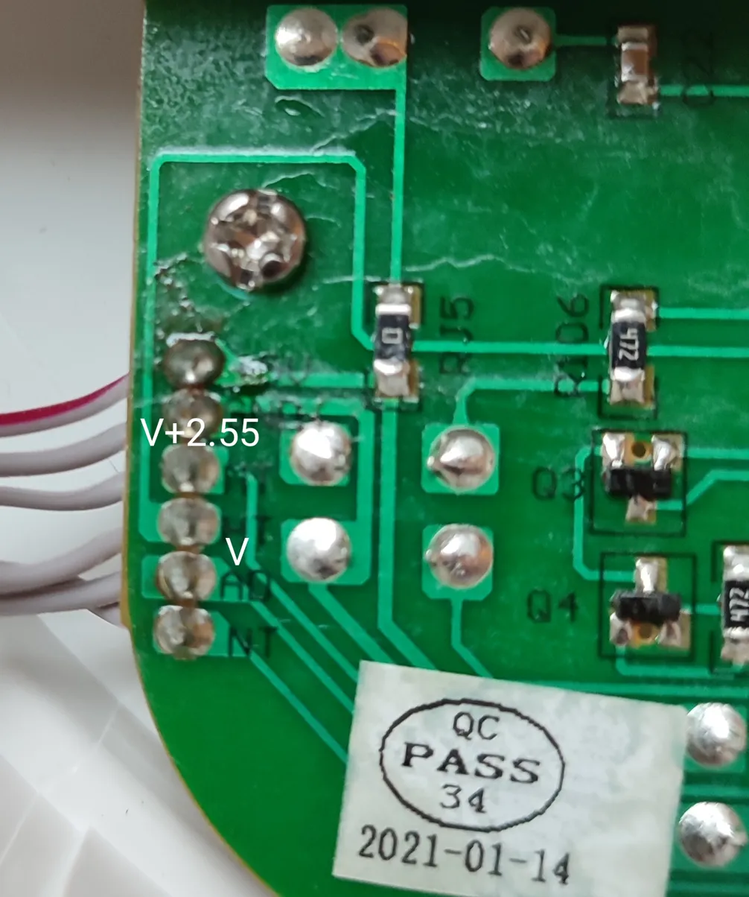
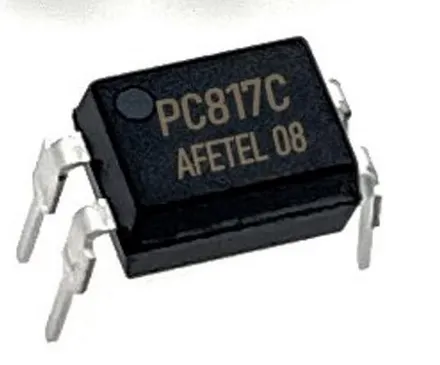
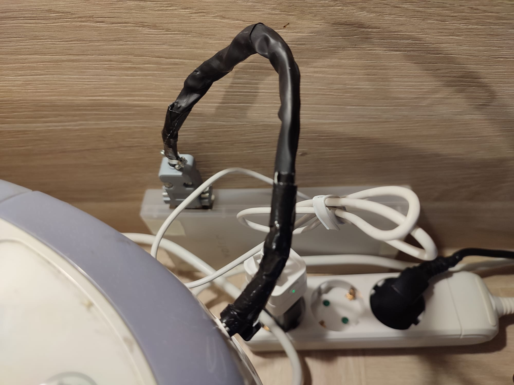
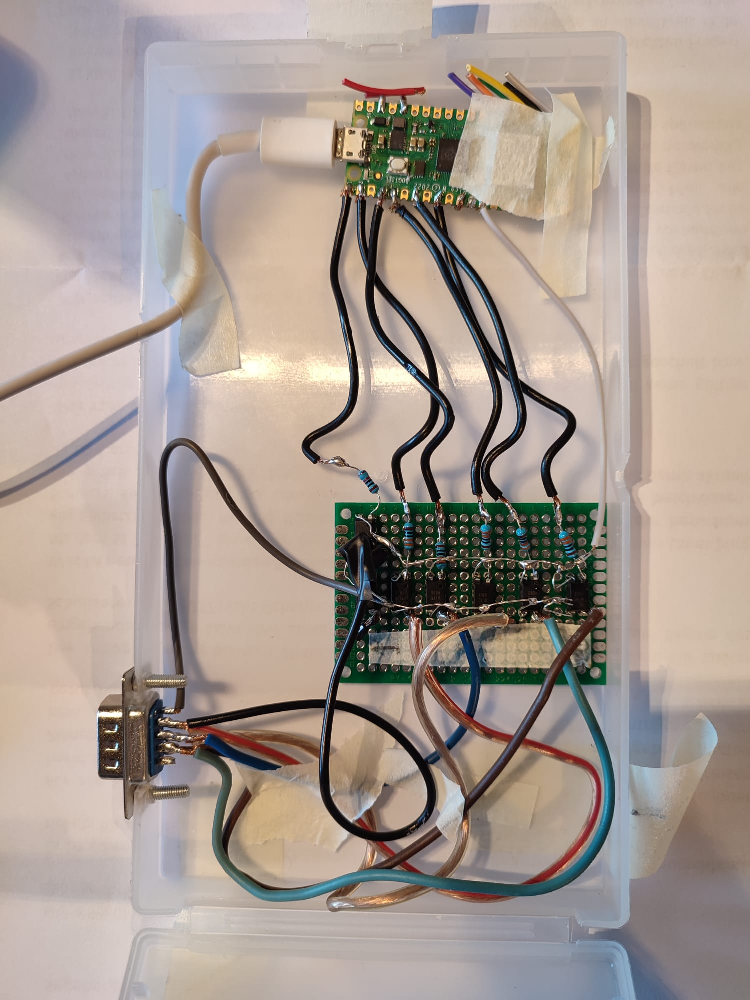

# breadmachine-controller

Remote control for an **ECG PCB 82120** bread machine via a Raspberry Pi, Node-RED, MQTT, and a Raspberry Pi Pico W.



## Motivation

- Start baking programs remotely from a smartphone
- Schedule bread to be **ready at a specific time** without manual intervention
- Chain **Program 7 (Dough)** immediately followed by **Program 1 (Bread)** at a set time, without needing to be present when the dough program finishes
- Insert a **user-defined rest phase** between kneading and baking, so that the dough can develop over many hours (e.g. overnight cold ferment for a total lead time of 18 h or more) without the excessively long rise that would produce an over-acidic loaf
- Automatically **stop the machine** when the bread is ready, disabling the one-hour keep-warm phase that would otherwise dry out the crust

---

## Table of Contents

1. [System Overview](#1-system-overview)
2. [Hardware](#2-hardware)
3. [Opening the Bread Machine](#3-opening-the-bread-machine)
4. [Circuit](#4-circuit)
5. [Assembly](#5-assembly)
6. [Firmware (Pico W)](#6-firmware-pico-w)
7. [Node-RED Flow](#7-node-red-flow)
8. [System Architecture](#8-system-architecture)
9. [Known Limitations and Notes](#9-known-limitations-and-notes)
10. [License](#10-license)

---

## 1. System Overview

A Raspberry Pi running **Node-RED** and **Mosquitto** acts as the central hub. A **Pico W** connected to the bread machine's control panel receives MQTT commands and simulates button presses via **PC817C optocouplers**, wired to the machine's PCB through a **Sub-D 9 connector**.

```
Smartphone
    |  (browser)
    v
Node-RED Dashboard  (Raspberry Pi)
    |  MQTT  breadmachine/cmd
    v
Pico W
    |  GPIO -> 470 ohm -> PC817C LED
    v
PC817C phototransistor in parallel with button contacts
    |
ECG PCB 82120 control board
```

The two programs used are:

| Program | Description | Duration |
|---------|-------------|----------|
| 1 | Basic - 1250 g, dark crust | 3 h 15 m |
| 7 | Dough (Pasta) | 15 min |

---

## 2. Hardware

| Component | Qty | Notes |
|-----------|-----|-------|
| ECG PCB 82120 bread machine | 1 | |
| Raspberry Pi | 1 | Runs Node-RED + Mosquitto |
| Raspberry Pi Pico W | 1 | MicroPython firmware |
| PC817C optocoupler (DIP-4) | 6 | One per button |
| Resistor 470 ohm | 6 | LED current limiting, Pico GPIO side |
| Sub-D 9 female connector | 1 | On the PCB inside the enclosure |
| Sub-D 9 male connector | 1 | On the cable going to the bread machine |
| Perfboard | 1 | ~5 x 7 cm |
| Plastic enclosure box | 1 | Houses Pico W + optocoupler board |
| Thin hookup wire | - | 30 AWG or similar |
| Zigbee USB switch (optional) | 1 | For automatic Pico power cycling |

---

## 3. Opening the Bread Machine

### Identifying the control PCB

The control panel is a single PCB screwed inside the front housing. After removing the back cover, both sides of the PCB are accessible.



*Back side of the control PCB. Six rectangular SMD footprints (tactile switch pads) are visible, one per button.*

### Voltage measurements

The six buttons share a common ground rail. Measuring across each button's two active pads (machine powered on, idle) gives **+2.55 V**, with the lower-voltage pad floating at approximately -12.6 V relative to mains earth. This confirms the machine's internal logic is **galvanically isolated from mains earth** (Class II appliance), and the internal logic supply is approximately 2.55 V.



*Close-up of button pads with voltage annotations. V+2.55 is the pull-up side; V is the internal GND.*

### Polarity note

The PC817C in this application has:
- **Pin 4 (Collector)** connected to the V+2.55 pad (higher potential)
- **Pin 3 (Emitter)** connected to the V pad (internal GND)

This is the reverse of the labelling sometimes found in datasheets. Verify empirically before soldering.

### Sub-D 9 pinout

All six internal GND pads are at the same potential and share a single pin on the Sub-D connector.

| Sub-D pin | Signal |
|-----------|--------|
| 1 | MENU - V+2.55 |
| 2 | LOAF SIZE - V+2.55 |
| 3 | COLOR - V+2.55 |
| 4 | MINUS - V+2.55 |
| 5 | PLUS - V+2.55 |
| 6 | START/STOP - V+2.55 |
| 9 | Common GND (all buttons) |

---

## 4. Circuit

One PC817C per button. The LED side is driven by the Pico W GPIO; the phototransistor side is wired in parallel with the button contacts on the bread machine PCB.

```
Pico W GPIO (3.3 V)
       |
     [470 ohm]
       |
   PC817C pin 1  (Anode)
   PC817C pin 2  (Cathode) -- GND (Pico)

   PC817C pin 4  (Collector) -- V+2.55 pad on button
   PC817C pin 3  (Emitter)   -- V/GND pad on button
```

**Resistor calculation:**

```
R = (3.3 V - 1.2 V) / 10 mA = 210 ohm  ->  use 470 ohm (conservative, ~4.5 mA)
```

The phototransistor switches the ~25-250 uA pull-up current of the machine's MCU, well within PC817C ratings.



*PC817C pinout (DIP-4): pin 1 top-left at the dot mark, counterclockwise numbering.*

---

## 5. Assembly

Twelve wires are soldered to the six button footprints on the PCB back, one wire per active pad. Wires are routed to the Sub-D 9 male connector attached to the machine housing.



*Sub-D 9 male connector attached to the bread machine housing, with thin wires running to the button pads.*

The Pico W and optocoupler board are housed in a small plastic enclosure connected to the bread machine via the Sub-D 9 cable.



*Inside the enclosure: Pico W (top), perfboard with 6x PC817C and 6x 470 ohm resistors (centre), Sub-D 9 female connector (bottom-left).*

---

## 6. Firmware (Pico W)

### Files

| File | Description |
|------|-------------|
| `firmware/main.py` | Main firmware: GPIO setup, MQTT callback, main loop |
| `firmware/mqtt_utils.py` | WiFi connection and MQTT client setup |
| `firmware/sync_utils.py` | NTP time sync and DST offset table for Germany (CET/CEST) |

### Configuration

In `firmware/mqtt_utils.py`, set your WiFi credentials and MQTT broker IP:

```python
ssid     = 'your_ssid'
password = 'your_password'

# in connectMQTT():
server = b"192.168.x.x"   # Raspberry Pi IP
```

### Dependencies

- MicroPython with `umqtt.simple` (included in standard Pico W MicroPython builds)
- `picozero` (for LED feedback during WiFi connection)

### Main loop behaviour

- Polls `check_msg()` every 0.5 s for incoming MQTT messages
- Checks WiFi connectivity on every iteration; reconnects automatically on failure
- Calls `client.disconnect()` and `gc.collect()` before reconnecting to avoid memory exhaustion
- Falls back to `machine.reset()` if reconnection fails
- Hardware watchdog (WDT, 8 s timeout) resets the Pico if the loop stalls
- WiFi power management disabled (`wlan.config(pm=0xa11140)`) to avoid reception delays
- Daily reset at 03:10 local time (10 minutes after the Raspberry Pi scheduled 03:00 restart)
- Time check uses the on-board RTC (set at boot via NTP) to avoid blocking network calls in the loop

### Button simulation

Each MQTT command triggers a sequence of simulated button presses:

```
start:<prog>:<loaf>:<color>:<delay>
```

- `prog`: number of MENU presses
- `loaf`: cycles LOAF SIZE to 750g / 1000g / 1250g
- `color`: cycles COLOR to lower / medium / dark / rapid
- `delay`: each press adds 10 min (first press adds 5 min). Currently unused by the Node-RED flow, kept for firmware backward compatibility.
- Fields can be empty to skip (e.g. `start:7:::` uses all defaults)

`stop`: holds START/STOP for 2 s to interrupt any running program.

---

## 7. Node-RED Flow

### Import

Import `nodered/breadmachine_flow.json` via **Menu -> Import**. After import:

1. Check the **MQTT broker** node points to your broker IP and port
2. If using the USB power cycle feature, check the **USB switch MQTT broker** node points to your Zigbee2MQTT instance
3. Verify the file path in the **file** nodes matches your system (`/home/pi/breadmachine_pending.json`)
4. Deploy

### Dashboard

The dashboard (at `http://<raspberry-pi-ip>:1880/ui`) provides:

| Element | Function |
|---------|----------|
| Pronto alle (HH:MM) | Target ready time input |
| Tempo di riposo (min) | Rest time between end of Prog 7 and start of Prog 1 (used only by the delayed-Prog-7 button) |
| Power cycle USB toggle | Enable/disable optional USB power cycling |
| Prog 7 - Impasto (ora) | Start Program 7 immediately |
| Prog 1 - Pane (programmato) | Start Program 1 at the target time |
| Prog 7 ora + Prog 1 programmato | Start Program 7 now, Program 1 at target time (dough sits in the machine until Prog 1 starts) |
| Prog 7 ritardato + Prog 1 programmato | Schedule both programs so that the dough rests exactly the requested time between the end of Prog 7 and the start of Prog 1 |
| Ferma macchina | Send stop to bread machine immediately |
| Annulla comando in attesa | Cancel any pending scheduled command and clear the pending file |
| Stato | Live status and countdown display |

### Timing logic

When any of the timed buttons is pressed, Node-RED:

1. Validates that enough time remains before the target
2. Calculates when to send each command
3. Writes the full event list (all starts + stop) to `/home/pi/breadmachine_pending.json`
4. Schedules each command with `setTimeout`
5. Schedules the stop 3 minutes after the target time

Per-button behaviour:

- **Prog 1 programmato**: start at `target - 196 min`; requires at least 3 h 16 m ahead
- **Prog 7 ora + Prog 1 programmato**: Prog 7 immediately, Prog 1 at `target - 196 min`; requires at least 3 h 31 m ahead
- **Prog 7 ritardato + Prog 1 programmato**:
    - Prog 1 at `target - 196 min`
    - Prog 7 at `target - 196 - rest - 15 min` (accounting for its own 15 min duration)
    - If that ideal Prog 7 start is in the past, Prog 7 starts immediately and a warning shows the actual (shorter) rest time
    - Requires at least 3 h 31 m ahead; below that the button aborts with a warning

### File-based persistence

All scheduled events are persisted to `/home/pi/breadmachine_pending.json` in the following format:

```json
{
  "events": [
    {"cmd": "start:7:::",           "at": 1710000000000},
    {"cmd": "start:1:1250g:dark:",  "at": 1710004500000},
    {"cmd": "stop",                 "at": 1710015900000}
  ]
}
```

This makes the system fully resilient to reboots, including the daily 03:00 restart. On every startup, a startup inject fires 30 s after boot, reads the file, and:

- If an event time is in the **future**: reschedules it (including its power cycle if enabled)
- If an event time is within **5 minutes in the past**: sends the command immediately
- If **older than 5 minutes**: shows a warning on the dashboard and skips it

The file is updated on every scheduling action, cleared when the schedule completes normally, and cleared by the Stop and Kill buttons.

### USB power cycle (optional)

When the Power cycle USB toggle is ON and a Zigbee USB switch is connected to the Pico W USB port:

- 1 minute before each scheduled command (Prog 7, Prog 1, and stop): the Pico is power-cycled (off for 5 s, then on)

This ensures a fresh connection before each critical command. The 1 minute after re-power gives the Pico time to complete boot, connect to WiFi and re-subscribe to MQTT (hence the 196-minute figure used for Program 1 duration, which includes a 1-minute boot margin). When disabled the flow behaves identically to a setup without the USB switch.

### MQTT topics

| Topic | Direction | Description |
|-------|-----------|-------------|
| `breadmachine/cmd` | Node-RED -> Pico W | Commands (`start:...` or `stop`) |
| `zigbee2mqtt/usb_switch_01/set` | Node-RED -> Zigbee2MQTT | USB switch control (optional) |

---

## 8. System Architecture

```
+--------------------------------------------------+
|               Raspberry Pi                        |
|                                                   |
|  +---------------+    +-----------+              |
|  |   Node-RED    |--->| Mosquitto |              |
|  |   Dashboard   |    |  (MQTT)   |              |
|  +---------------+    +-----+-----+              |
|                             |                    |
|  /home/pi/                  | breadmachine/cmd   |
|  breadmachine_pending.json  |                    |
+-----------------------------+--------------------+
                              | WiFi
                     +--------v--------+
                     |    Pico W       |
                     |  (MicroPython)  |
                     +--------+--------+
                              | GPIO (6 pins)
                     +--------v--------+
                     |  6x PC817C      |
                     |  optocouplers   |
                     +--------+--------+
                              | Sub-D 9 cable
                     +--------v--------+
                     |  ECG PCB 82120  |
                     |  control board  |
                     +-----------------+
```

### GPIO assignments

| GPIO | Button |
|------|--------|
| GP0 | START/STOP |
| GP1 | COLOR |
| GP2 | PLUS (+) |
| GP3 | MINUS (-) |
| GP5 | LOAF SIZE |
| GP6 | MENU |

---

## 9. Known Limitations and Notes

**Program timings are hardcoded.** The 196-minute duration for Program 1 (195 min actual + 1 min Pico boot margin when using USB power cycle) and 15 minutes for Program 7 are fixed in the Node-RED function nodes. Adjust `PROG1_MS` and `PROG7_MS` in the function nodes if your machine differs.

**Node-RED linter warning.** The function nodes may show a red triangle in the editor when opened and closed without changes. This is a false positive from the ACE editor linter, which flags `node.send()` calls inside nested `setTimeout` closures. The code passes JavaScript syntax validation and works correctly at runtime.

**Pico W connectivity.** The Pico W used in development showed occasional WiFi instability. The firmware includes automatic reconnection and a hardware watchdog. The optional Zigbee USB switch can power-cycle the Pico before critical commands as an additional reliability measure. Disabling WiFi power management (`pm=0xa11140`) eliminated multi-second reception delays.

---

## 10. License

This project is licensed under the **GNU General Public License v3.0**.
See [https://www.gnu.org/licenses/gpl-3.0.html](https://www.gnu.org/licenses/gpl-3.0.html) for the full text.

Copyright 2026 [tmazza79](https://github.com/tmazza79)
